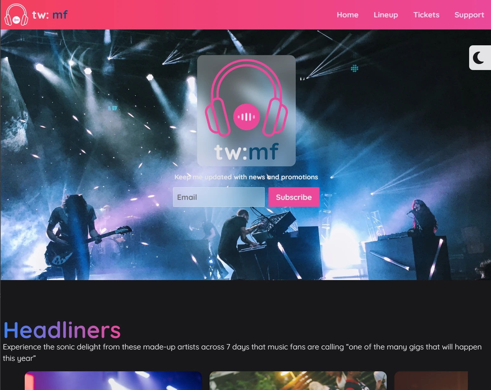

# Tailwind CSS Practice: Music Festival

This project is a practice implementation of a music festival landing page using Tailwind CSS.
It demonstrates various Tailwind CSS features and responsive design techniques.



# Features

- Responsive design for mobile and desktop layouts
- Dark mode toggle
- Custom animations
- Interactive carousel for featured artists
- Sticky navigation with dropdown menu
- Timeline layout for event schedule
- Ticket information table

# Getting Started

To get started with this project, follow these steps:

## 1. Clone the repository:

```

git clone https://github.com/Frederic-K/TailwindcssPracticeMusicFestival.git

```

## 2. Navigate to the project directory:

```

cd TailwindcssPracticeMusicFestival

```

## 3. Install dependencies:

```

npm install

```

or

```

yarn install

```

## 4. Start the live server:

```

double click on html file

```

or

```

run vscode live server

```

## Project Structure

- `src/`: Contains the source code
- `index.html`: Main HTML file
- `input.css`: Tailwind CSS input file
- `output.css`: Compiled CSS file
- `assets/`: Contains images and other static assets
- `plugins/`: Custom Tailwind CSS plugins
- `tailwind.config.js`: Tailwind CSS configuration file

## Built With

- [Tailwind CSS](https://tailwindcss.com/) - A utility-first CSS framework
- [Vite](https://vitejs.dev/) - Next Generation Frontend Tooling

## License

This project is open source and available under the [ISC License](LICENSE).

## Acknowledgments

- Font Awesome for icons
- Unsplash for stock images (if applicable)

```

```
